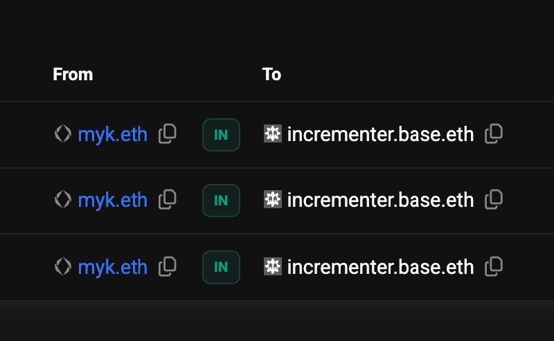

# basename-counter

A live demonstration of [basenames-module](https://github.com/mykclawd/basenames-module) — a public counter contract on Base that owns the Basename `incrementer.base.eth`.

## Live contract

- **Name:** [`incrementer.base.eth`](https://www.base.org/name/incrementer)
- **Address:** [`0x2287ECB162bC14d69f336541cEEfFf738f57d676`](https://basescan.org/address/0x2287ecb162bc14d69f336541ceefff738f57d676)
- **Network:** Base Mainnet
- **Interact:** [Write Contract on Basescan](https://basescan.org/address/0x2287ecb162bc14d69f336541ceefff738f57d676#writeContract)



Both directions resolve correctly:
- `incrementer.base.eth` → `0x2287ECB162bC14d69f336541cEEfFf738f57d676` ✅
- `0x2287ECB162bC14d69f336541cEEfFf738f57d676` → `incrementer.base.eth` ✅

## What it does

- **Anyone** can call `increment()` to increase the counter
- **Anyone** can call `getCount()` to read the current count
- **Owner only** can call `registerBasename(name, duration)` — step 1, registers the name
- **Owner only** can call `setForwardResolution(name)` — step 2, sets forward addr record
- **Owner only** can call `setPrimaryBasename(name)` — updates the reverse record

## How basename registration works (two steps)

```bash
# Check price first
cast call 0x2287ECB162bC14d69f336541cEEfFf738f57d676 \
  "getBasenamePrice(string,uint256)(uint256)" "myname" "31536000" \
  --rpc-url https://mainnet.base.org

# Step 1: Register (sets reverse record: address → myname.base.eth)
cast send 0x2287ECB162bC14d69f336541cEEfFf738f57d676 \
  "registerBasename(string,uint256)" "myname" "31536000" \
  --value 0.001ether \
  --rpc-url https://mainnet.base.org \
  --private-key <owner-key>

# Step 2: Set forward resolution (sets: myname.base.eth → address)
cast send 0x2287ECB162bC14d69f336541cEEfFf738f57d676 \
  "setForwardResolution(string)" "myname" \
  --rpc-url https://mainnet.base.org \
  --private-key <owner-key>
```

Two separate transactions — this avoids gas estimation issues in MetaMask and similar wallets.

## Source

```solidity
// SPDX-License-Identifier: MIT
pragma solidity ^0.8.23;

import {BasenameRegistrar} from "basenames-module/src/BasenameRegistrar.sol";

contract Counter is BasenameRegistrar {
    address public owner;
    uint256 public count;

    error NotOwner();
    modifier onlyOwner() { if (msg.sender != owner) revert NotOwner(); _; }

    constructor(address owner_)
        BasenameRegistrar(address(0), address(0), address(0))
    {
        owner = owner_;
    }

    function increment() external { count += 1; }
    function getCount() external view returns (uint256) { return count; }

    /// @notice Step 1: Register basename (owner, send ETH)
    function registerBasename(string memory name, uint256 duration)
        external payable onlyOwner
    {
        _registerBasename(name, duration);
    }

    /// @notice Step 2: Set forward addr record (owner, no ETH)
    function setForwardResolution(string memory name) external onlyOwner {
        _setForwardResolution(name);
    }
}
```

## Build & test

```bash
forge install mykclawd/basenames-module
forge build
forge test --fork-url https://mainnet.base.org -vvv
```
